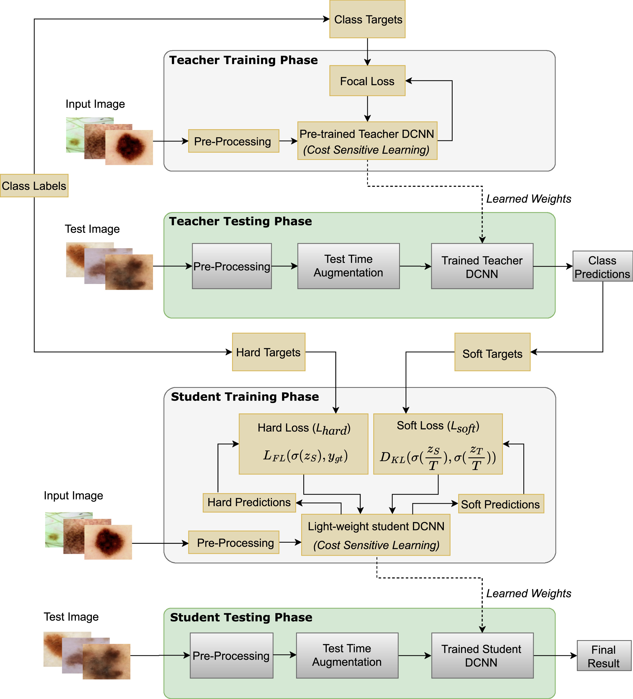

[](https://huggingface.co/spaces/anil-adepu/Melanoma-Classification-using-Knowledge-Distillation-for-Highly-Imbalanced-Data)


Official code for the paper: [Melanoma classification from dermatoscopy images using knowledge distillation for highly imbalanced data](https://www.sciencedirect.com/science/article/pii/S0010482523000367) published in [Computers in Biology and Medicine, Elsevier](http://www.elsevier.com/locate/compbiomed). A live demo is available [here](https://huggingface.co/spaces/anil-adepu/Melanoma-Classification-using-Knowledge-Distillation-for-Highly-Imbalanced-Data).


**TL;DR** Melanoma classification task is challenging due to the high inter-class and low intra-class similarity problems in dermoscopic image datasets. The work proposes a novel knowledge-distilled lightweight Deep-CNN-based framework to tackle the high inter-class and low intra-class similarity problems with Knowledge Distillation, Cost-Sensitive Learning with Focal Loss for addressing class imbalance to achieve better sensitivity scores.


### Citation

If you use this code in your scientific work, please cite the
following paper:

```bibtex
@article{adepu2023melanoma,
  title={Melanoma classification from dermatoscopy images using knowledge distillation for highly imbalanced data},
  author={Adepu, Anil Kumar and Sahayam, Subin and Jayaraman, Umarani and Arramraju, Rashmika},
  journal={Computers in Biology and Medicine},
  pages={106571},
  year={2023},
  publisher={Elsevier}
}
```

<p align="center">
<a href="#"></a><br/>
<strong>Proposed framework for Melanoma Classification using Knowledge Distillation</strong>
</p>


### Major Requirements

* Tensorflow: 2.4.0 or above
* TensorFlow Addons: 0.14.0 or above
* Python: 3.7 or above


### Processed Datasets
* __JPEG__: [https://www.kaggle.com/datasets/akra98/isic2020-jpg-256x256-inpainted2](https://www.kaggle.com/datasets/akra98/isic2020-jpg-256x256-inpainted2). Code to re-generate these images is available under `preprocess` directory above.
* __TFRECORDS__: [https://www.kaggle.com/datasets/aniladepu/isic2020-tfrec-256x256-inpainted2](https://www.kaggle.com/datasets/aniladepu/isic2020-tfrec-256x256-inpainted2). A sample code to create tfrecords is available [here](https://www.kaggle.com/code/aniladepu/create-tfrecords/notebook).


